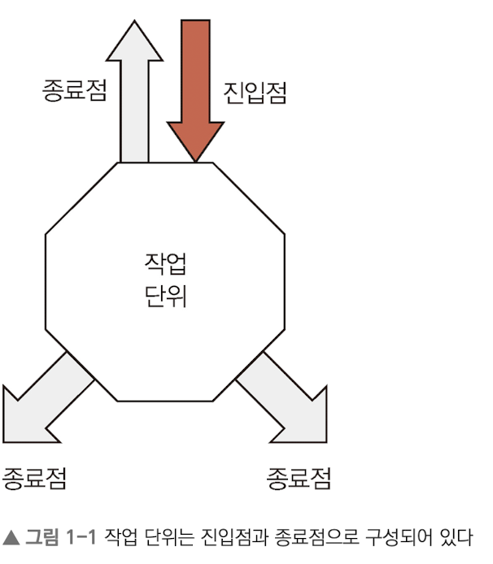

# 1장. 단위 테스트의 기초

> **1장**
> 
> 
> ‘단위’에 대한 정의와 ‘좋은’ 단위 테스트란 무엇인지.
> 
> TDD(테스트 주도 개발) vs 단위 테스트
> 

</br>

### 1.1 누구에게나 처음은 있다.

코드를 매번 직접 검증하는 일(디버깅) → 매우 힘듬 

테스트와 회귀 테스트(regression test) 자동화 필요

</br>

### 1.2 단위 테스트의 정의


단위 테스트의 기원

- 1970년대 스몰토크(Smalltalk) 라는 프로그래밍 언어에서 등장
- 켄트 백이(Kent beck)이 이 개념을 발전 시킴

단위테스트(unit test) 란?

- 예제 코드의 특정 모듈이 의도된 대로 정확히 작동하는지 검증하는 절차
- 즉, 모든 함수와 메서드에 대한 테스트 케이스(test case)를 작성하는 절차를 말함
- 코드 변경으로 인해 문제가 발생할 경우, 단시간 내에 이를 파악하고 바로 잡을 수 있도록 해줌
- 이상적으로, ***각 테스트 케이스는 서로 분리되어야함***

**테스트 대상(Suite Under Test, SUT)**

- SUT는 테스트 중인 주제(subject), 시스템(system), 테스트의 모음(suite)을 의미함
- 일부는 CUT(component, class, code Under Test)라는 용어를 사용하기도 함
    
    **⇒ 무언가를 테스트할 때, 테스트하고자하는 주요 대상을 SUT이라고함**
    

단위(unit)란?

- 시스템(system) 내 **작업 단위(unit of work)** 또는 사례(use case) 를 의미함
    - 작업 단위에는 시작(entry point)과 끝이 있음(exit point)
    - 보통은 하나의 함수 또는 메서드가 단위가 됨  - 무엇을 계산하고 계산된 값을 반환
        - 함수 내부에서 다른 함수나 모듈, 컴포넌트 따위를 사용할 수도 있음
        - 함수의 바디: 작업 단위의 전체나 일부를 의미
        - 함수의 선언과 서명: 바디로의 진입점
        - 함수의 출력이나 실행 결과: 함수의 종료점임
        

</br>

### 1.3 진입점과 종료점

작업 단위에는 항상 하나의 진입점과 하나 이상의 종료점이 있음 

- 작업 단위
    - 작업 단위는 함수 하나만 의미할 수도 있고, 여러 함수를 의미할 수도 있음
    - 작업 단위는 의미있는 작업을 함
    - **의미 있는 작업?**
        - 단순히 값을 반환하는 것, 어떤 상태를 변경하거나 서드 파티 코드를 호출하는 등 뭔가 눈에 띄는 동작을 의미

**진입점**



- 작업 단위에는 하나 이상의 진입점이 존재함
- 테스트를 시작하는 곳, 검증하고 싶은 함수나 메서드를 호출하는 시점

**종료점** 


- 위 이미지의 세 가지 종료점: 값 반환, 상태 값 변경, 서드 파티 호출
- 해당 함수의 작업 단위가 돌아가는 실행 컨텍스트(execution context)에서 벗어나 다시 테스트가 있던곳으로(test context) 돌아가는 것
    
    → 작업 단위가 종료되며 **무언가 눈에 띄는 결과**가 나오는 지점

</br>

예제 1-1 값을 반환하는 간단한 함수

```java
package ch01;

public class StringAdder {
    public static int sum(String numbers) {
        String[] parts = numbers.split(",");
        int a = Integer.parseInt(parts[0].trim());
        int b = Integer.parseInt(parts[1].trim());
        return a + b;
    }
}
```

- 작업 단위 - sum 함수
- 함수는 진입점이며, 최종 결과를 반환하는 종료점 역할도함
    
    
    
    진입점과 종료점이 같은 함수
    
    - 진입점(함수 시그니처) : `sum(numbers)`

</br>

예제 1-2 진입점과 종료점을 가진 작업 단위

```java
package ch01;

public class StringAdder2 {
    private static int total = 0;

    public static int sum(String numbers) {
        String[] parts = numbers.split(",");
        int a = Integer.parseInt(parts[0].trim());
        int b = Integer.parseInt(parts[1].trim());

        int result = a + b;
        total += result;

        return result;
    }

    public int totalSoFar() {
        return total;
    }
}
```

[sum 함수의 두개의 종료점]


- 숫자의 합 반환
- 숫자의 합을 total 에 추가 하는 누적 합계 계산 (상태(total) 변환)

total 변수를 하나의 state 값

- 상태값 total은 `totalSoFar()` 함수의 종료점으로 확인 가능
- `totalSoFar()` 함수는 sum 함수를 호출한 진입점에서 호출될 수 있음

위처럼 두 종료점을 가진 작업 단위는 

같은 작업 단위에서 나오는 서로 다른 경로나 요구사항으로 보이기도함 

 = 즉, 개별적인 테스트 코드로 바꿀 수 있다는 의미 

`totalSoFar()`함수 

- 하나의 진입점으로 볼 수 있음
- sum 함수를 호출하지 않은 상태에서 불릴 수 있음  → 하나의 작은 작업 단위

sum 함수 와 같은 하나의 작업 단위는 더 작은 작업 단위의 집합으로 구성될 수 있음

<aside>

정리

테스트 코드의 범위는 작성 방식에 따라 얼마든지 바뀔 수 있다.

하지만 코드의 진입점과 종료점을 정의할 수 있고, 진입점은 항상 테스트가 작업 단위를 시작하는 지점이다. 

작업 단위에는 진입점이 여러 개 있을 수 있으며, 각 진입점은 서로 다른 테스트 코드에서 사용할 수 있다.

</aside>

- **코드 설계 방향**
    
    <aside>
    
    [코드 작성시  알고 있으면 좋은 내용]
    
    - 두 가지 액션(action)
        - 쿼리(query): 상태를 변경하지 않고 오직 값을 반환
        - 명령(command): 상태를 변경하지만 값은 반환하지 않음
    
    위 둘을 자주 결합해서 사용함, but 분리해서 설계하는 것이 더 나을 때가 많음 
    참고) 마틴 파울러(Martin Fowler) 블로그
    
    </aside>
    
</br>

예제 1-3 함수에 로드를 출력하는 로직 추가하기 

```java
package ch01;

import org.slf4j.Logger;
import org.slf4j.LoggerFactory;

public class StringAdderLogging {
    private static int total = 0;
    private static final Logger logger =  LoggerFactory.getLogger(StringAdderLogging.class);;

    public static int sum(String numbers) {
        String[] parts = numbers.split(",");

        logger.info("this is a very important log output - firstNumWas: {}, secondNumWas: {}", parts[0], parts[1]);

        int a = Integer.parseInt(parts[0].trim());
        int b = Integer.parseInt(parts[1].trim());

        int result = a + b;
        total += result;

        return result;
    }

    public int totalSoFar() {
        return total;
    }
}
```


- 새로운 종료점 추가 - `logger() 함수`
    - logger 함수는 외부에 무선가를 기록함
    - **서드파티 호출, 의존성 호출이라고도함**

- 진입점은 함수 호출이지만 세 가지의 종료점이 있음
    
    → 종료점마다 테스트 코드를 하나씩 만들 수 있음 (총 3가지)
    
- 종료점마다 테스트를 만들어 분리하면 각 테스트끼리 영향을 주지 않고, 더 읽기 쉬우며, 디버깅하기도 쉬움

<aside>

의존성 정의
의존성: 단위 테스트 중 온전히 제어할 수 없는 것을 의미 

[종류]

- 파일에 무언가를 기록
- 네트워크와 통신
- 다른 팀이 관리하는 코드
- 데이터베이스에 접근하는 행위
- 오래 걸리는 계산 작업

[의존성이 아닌 것]

- 어떤 행위를 쉽게 제어할 수 있는 경우
- 메모리 내에서 실행되는 경우
- 빠른 속도로 처리되는 경우
</aside>

</br>

### 1.4 종료점 유형

[작업 단위의 세 유형]

1. 함수가 undefined 가 아닌 **값을 반환함**
2. 함수 호출 전과 후에 상태 값이 달라져 내부 상태를 직접 들어다보지 않고도 확인할 수 있음
    
    → 상태 변경
    
3. 코드의 실행 주도권이 없는 서드 파티 함수를 호출
    
    → logger 함수는 값을 반환하고 있지 않음
    

단위 테스트의 핵심 구조

- 단위 테스트는 진입점(함수 호출) → 종료점(검증 대상)을 기준으로 구성
    
    → 최종 결과(=종료점)가 테스트가 검증하고자하는 바와 다르면 단위 테스트 실패
    

단위 테스트의 범위

- 진입점과 종료점 사이에 사용되는 함수와 모듈 수에 따라 함수 하나에서 여러 모듈이나 구성 요소에 이를 수 있음
    
    → 테스트의 함수가 다른 함수나 모듈을 많이 호출한다면 결국 그 테스트가  여러 컴포넌트를 포함한 테스트가 될 수 있다는 뜻
    

</br>

### 1.5  다른 종료점, 다른 기법
각 종료점마다 테스트를 만들어 분리하는 것이 코드 관리 측면에서 유리하고

종료점 종류에 따라 테스트 방법이 다름 

1. 반환값이 있는 종료점(<xUniit 테스트 패턴> 에서의 직접 출력)
    - 테스트하기 가장 쉬운 타입
    - 작업 단위를 실행하여 진입점을 호출하고 실행 결과 값을 받아 그 값을 확인하면 됨
    
2. 상태 값을 변경하는 종료점(간접 출력)
    - 더 많은 작업이 필요함
    - 어떤 것을 호출한 후 다른 것을 호출하여 무언가를 확인하거나
    - 이전에 호출한 것을 다시 호출하여 모든 것이 의도대로 흘러갔는지 확인해야함
    
3. 서드 파티를 호출하는 종료점
    - 가장 많은 작업이 필요
    - 서드 파티는 외부에 실행 주도권이 있는 상황이라 코드 간섭이 힘듬
    - 모의 객체(mock objects)를 만들어 테스트 결과를 임의로 조작하는 방법을 사용

필자의 경험.

가능한 모의 객체를 사용하는 테스트는 피하려고함

복잡성을 증가시키고 유지보수를 어렵게 만들기 떄문

</br>

### 1.6 처음부터 테스트 코드 작성


예제 1-4 sum 함수를 테스트하는 기초적인 테스트 코드 

```java
package ch01;

class StringAdderTest {
        public static void main(String[] args) {
            try {
                int result = StringAdder.sum("1,2");

                if (result == 3) {
                    System.out.println("parserTest example 1 PASSED");
                } else {
                    throw new RuntimeException("parserTest: expected 3 but got " + result);
                }

            } catch (Exception e) {
                e.printStackTrace();
            }
        }
}
```

- 실제 모듈(SUT) 인 sum 함수를 호출한 후 반환값을 확인함
- 위 방식은 다양한 입력값이 주어질 수 있는 여러 경우를 고려하지 않은 것
    - 모든 테스트에서 사용할 수 있는 `test`나 `check` 같은 보다 범용적인 검증 함수를 만들어 오류를 일관 되게 처리하는 편이 나은 선택
    - 헬퍼(helper: null, undefined, 빈문자열, falsy 등 값을 확인하는) 메서드를 추가하면 재사용할 수 있어 좋음

</br>

예제 1-6 좀 더 범용적인 check 함수를 만들어서 테스트하기

```java
package ch01;

class StringAdderTest2 {
    public static void assertEquals(int expected, int actual) {
        if (expected != actual) {
            throw new RuntimeException("expected " + expected + " but got " + actual);
        }
    }

    public static void check(String name, Runnable implementation) {
        try {
            implementation.run();
            System.out.println(name + " PASSED");
        } catch (Exception e) {
            System.err.println(name + " FAILED");
            e.printStackTrace();
        }
    }

    public static void main(String[] args) {
        check("add 1,2", () -> assertEquals(3, StringAdder.sum("1,2")));
        check("add 3,7", () -> assertEquals(10, StringAdder.sum("3, 7")));

    }
}
```

- `assertEquals`: 콘솔에 출력하거나 오류 출력하는 반복 코드 삭제
- `check` : 테스트 제목과 실행 객체를 인자로 받고 내부에서 try-catch 구문으로 오류를 잡아냄

<aside>

Jnuit 에서 assert 함수 제공함. 자체적으로 검증 함수 만들 필요 없음

</aside>

</br>

### 1.7 좋은 단위 테스트의 특징
1. 테스트 작성자 의도를 이해하기 쉬워야 한다. 
2. 읽고 쓰기 쉬워야 한다.
3. 테스트를 자동화할 수 있어야 한다.
4. 같은 조건에서 실행 결과는 항상 같아야 한다.
5. 의미 있는 테스트여야 하고, 구체적인 결과를 제공하여 문제를 쉽게 파악하고 해결할 수 있어야한다.
6. 누구나 쉽게 실행할 수 있어야 한다.
7. 실패할 경우 무엇이 잘못되었는지 쉽게 알 수 있어야 한다.
8. 빠르게 실행되어야 한다.
9. 테스트 환경을 일관되게 유지하고, 테스트 결과가 항상 예측 가능해야 한다.
10. 다른 테스트와 완전히 독립적인 흐름으로 실행되어야 한다.
11. 시스템 파일, 네트워크, 데이터베이스가 없이도 메모리 내에서 실행되어야 한다.
12. 가능 한 동기적인 흐름으로 실행되어야 한다.

위 모든 특성을 만족시키는 것은 사실 불가능에 가까움 

리팩터링을 거쳐 많은 조건을 충족하도록 만들거나, 통합테스트로 만드는 것도 하나의 방법

<데이터베이스나 다른 의존성을 스텁으로 대체하기>

- 스텁(stub)
    - 실제 의존성을 흉내 내는 가짜 의존성
    - 실제 의존성에 접근하지 않고도 테스트에 필요한 값을 내가 원하는 방식으로 만들어 낼 수 있음
    - 예측 가능하고 안정적으로 진행 가능
- 인메모리 데이터베이스는 테스트 간에 DB 인스턴스를 공유하지 않기 때문에 단위 테스트 간의 독립성을 보장할 수 있음
    - 실제 운영 DB와는 기능 및 동작 방식이 다름(테스트는 통과하지만 실제 DB는 실패할 수 있음)
    - **단위 테스트**: 스텁 또는 인메모리 DB 사용
    - **통합 테스트**: 실제 데이터베이스에서 테스트 수행 필요

</br>

### 1.8 통합 테스트

통합테스트

- 단위 테스트 조건을 만족하지 못하는 모든 테스트를 의미
- 테스트가 실제 네트워크, 실제 REST API, 실제 시스템 시간, 실제 파일 시스템 또는 실제 데이터 베이스를 사용한다? → 통합 테스트
- 단위 테스트에서 검증하지 못하는 시스템 전체 작용을 확인할 수 있는 역할을 함
    
    
    
    통합 테스트는 하나라도 실패하면 제대로 된 결과물을 얻을 수 없음, 여러 기능이 연쇄적으로 동작하기 떄문에 버그 원인을 찾는 것도 쉽지 않음
    

통합 테스트 단점

- 통합 테스트는 단위 테스트 보다 훨씬 느림
- 데이터 정리 어려움(테스트 후 데이터 삭제, 복구)
- 제어 어려움(DB 성능/응답 시간 등 환경에 따라 결과가 달라짐)

<aside>

단위 vs 통합 

단위: 작업 단위를 의존성에서 격리 시켜 항상 일관된 결과를 받을 수 있도록 함 

통합: 실제 의존성을 사용

</aside>

<aside>

필자가 말하는 통합 테스트 정의

---

: 통합 테스는 다른 팀이 만든 모듈, 외부 API 나 서비스, 네트워크, 데이터베이스, 스레드 등 실제 의존성을 완전히 제어할 수 없는 상태에서 작업 단위를 테스트 하는 것이다.

</aside>

- +용어
    
    <aside>
    
    회귀(regression)
    
    ---
    
    이전에 동작하던 기능이 지금은 동작하지 않는 것임. 즉, 한때 작동하던 하나 이상의 작업 단위가 이제는 작동하지 않는 것을 의미함
    
    </aside>
    
    <aside>
    
    레거시 코드 정의
    
    ---
    
    현재 유지 보수 중인 오래된 버전의 애플리케이션을 레거시 코드라고함
    
    레거시 코드 = 테스트가 없는 코드로도 생각함
    
    </aside>
    

좋은 테스트란…

**빠르게 실행되고, 쉽게 작성할 수 있으며, 독립적으로 동작하며, 유지보수하기 쉬운 테스트**다.

좋은 테스트의 3요소

| **가독성** | 이해하기 쉬워야 유지·디버깅이 쉬움 |
| --- | --- |
| **유지 보수성** | 구조가 체계적이어야 리팩터링에도 강함 |
| **신뢰성** | 결과가 항상 같아야 함. 실패 이유가 명확해야 함 |

→ 단위 테스트가 좋은 테스트에 더 가까움

단위 테스트를 잘하려면…

- 도메인을 정확히 이해하고, 작업 단위의 진입점/종료점을 파악해야 제대로 된 테스트 작성이 가능

</br>

### 1.9 최종 정리

**단위 테스트란?** 

진입점을 통해 작업 단위를 호출하고, 그 종료점을 검증하는 자동화된 코드

단위 테스트는 왜 중요한가?

운영 코드가 변경되지 않는 한, 테스트는 항상 같은 결과를 반환 

잘 작성된 신뢰성과 가독성, 유지 보수성과 변경 감지에 효과적

단위테스트가 없으면 전체 테스트 수행 속도가 느려지고, 버그 추척도 어려워짐

****어떤 코드를 테스트해야 하나?

단순한 제어 흐름(if, for, 계산 등만 있는 코드) → 별도로 테스트할 필요 없음

단순한 getter/setter는 테스트 대상 아님

조건문/반복문/데이터 변환 등 논리가 추가된 경우 → 테스트 필요

</br>

### 1.10 테스트 주도 개발

언제 테스트를 작성 해야되나..?

보통은 기능 개발 후 테스트 진행 

하지만 코드 리뷰 과정이나 버그 수정에서 테스트의 필요성을 인식하게됨

(기능 구현 → 코드 리뷰 요청 → 테스트 없음 → 리뷰어 거절 → 테스트 작성)

→ 이런 영향을 받아 코딩하기 전에 단위 테스트를 작성하려는 접근이 생김 

→ 이게 바로 테스트 우선 또는 테스트 주도 개발이라고 함 

**테스트 주도 개발 (TDD)**

기능을 구현하기 전에 테스트부터 작성하는 방식 → 테스트가 개발의 시작점

1. 실패하는 테스트를 작성하는 것으로 시작함 
2. 테스트를 통과하도록 코드 수정 
3. 테스트 통과 후 리팩터링

→ 새로운 기능에 대한 테스트 작성..수정,,통과.. 리팩터링 반복

단위 테스트 vs 테스트 주도 개발 


