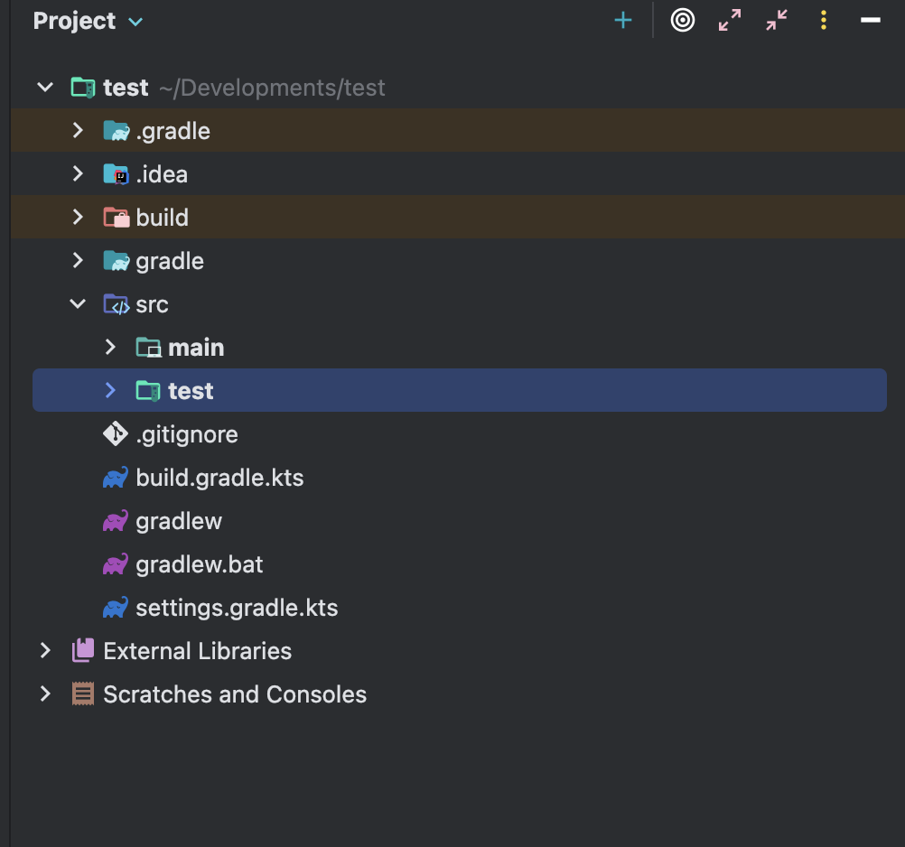

# 2장. 첫 번째 단위 테스트

---

> 2장
> 
> 
> 프레임워크를 사용해 단위 테스트 작성해볼 것.
> 
> 기본 API, 검증 방법, 테스트를 지속적으로 실행하는 방법.
> 

### 2.1 JUnit 소개

---

JUnit ****은 자바 프로그래밍 언어용 유닛 테스트 프레임워크이다. 

JUnit은 테스트 주도 개발 면에서 중요하며 SUnit과 함께 시작된 XUnit이라는 이름의 유닛 테스트 프레임워크 계열의 하나이다.

[JUnit 환경 설정]

- 주로 Maven이나 Gradle 과 같은 빌드 도구를 사용하여 설정
- `build.gradle.kts` 파일에 dependency 추가
    
    ```java
    testImplementation(platform("org.junit:junit-bom:5.10.0"))
    testImplementation("org.junit.jupiter:junit-jupiter")
    ```
    



 Gradle 프로젝트를 생성하면 자동으로 디렉터리 구조와 파일들이 기본 생성됨

테스트 파일 이름 : 테스트 대상 클래스명 + Test.java

실행 방식 : JUnit 테스트 프레임워크가 클래스의 `@Test` 어노테이션이 붙은 메서드 실행

</br>

### 2.2 라이브러리, 검증, 러너, 리포터

---

[JUnit의 역할]

- 테스트 라이브러리 역할
- Assertions 클래스사용하는 검증(assertion)라이브러리 역할
- 테스트 러너 역할
- 테스트 실행 결과를 보여주는 테스트 리포터 역할
- JUnit과 Spring Boot가 @BeforeEach, @Transactional 등과 같은 어노테이션 기반의 격리를 지원하는 도구를 제공
    - +Mock 프레임워크를 사용
    
    [테스트 격리(Test Isolation)](https://velog.io/@ljinsk3/%ED%85%8C%EC%8A%A4%ED%8A%B8-%EA%B2%A9%EB%A6%ACTest-Isolation)
    

### 2.3 단위 테스트 프레임워크가 제공하는 역할

---

- 테스트 코드의 일관된 형식: 구조화된 방식으로 테스트를 작성하므로 누구나 쉽게 읽고 이해할 수 있음
- 반복성: 새로운 테스트 작성 작업이 쉬움, 테스트 실패와 그 원인을 이해하기도 쉬움
- 신뢰성과 시간 절약
- 공동의 이해


JUnit5는 테스트 작성자를 위한 API 모듈과 테스트 실행을 위한 API가 분리되어 있음

**JUnit5 구조**

[JUnit5는 크게 3가지 모듈로 구성]

> JUnit5 = JUnit Platform + JUnit Jupiter + JUnit Vintage
> 

JUnit Jupiter API : JUnit5에 새로 추가된 테스트 코드용 API

| **모듈 이름** | **설명** |
| --- | --- |
| **JUnit Platform** | 테스트를 실행하는 엔진 역할IDE, Gradle, Maven 등과 연동됨
기초적인 역할을 수행하며 TestEngine API 를 제공 |
| **JUnit Jupiter** | JUnit 5에서 테스트를 작성하는 API (@Test, @BeforeEach 등)
TestEngine API 구현체
- **테스트 코드 작성에 필요한 junit-jupiter-api 
- 테스트 실행을 위한 junit-jupiter-engine 로 분리됨** |
| **JUnit Vintage** | JUnit 4/3 테스트 호환용 실행 엔진 (이전 버전 테스트를 실행해줌) |

### 2.4 앞으로 이 책에서 주로 다루는 예제: 비밀번호 검증 프로젝트

---

<aside>

첫 번째 시나리오 

---

- 비밀번호 검증 라이브러리를 만들 것
- 함수이름은 verifyPassword(rules)
    - 매개변수: rules (또 다른 함수: 객체 반환)
        
        ```java
        {
          passed: (boolean),  // 비밀번호가 조건을 만족하면 true
          reason: (string)    // 실패 시 그 이유를 설명하는 메시지
        }
        ```
        
    - 반환값: 에러 메시지를 담은 배열 반환
</aside>

예제 2-2 비밀번호 검증 버전 0

```java
package ch02.v0;

import java.util.ArrayList;
import java.util.List;

public class VerifyPassword {
    public static List<String> verifyPassword(String input, List<Rule> rules) {
        List<String> errors = new ArrayList<>();

        for(Rule rule : rules){
            RuleResult result = rule.check(input);
            if(!result.isPassed()){
                errors.add(result.getReason());
            }
        }
        return errors;
    }
}
```

- 매개변수로 전달된 규칙 함수 배열(rules)을 반복하면서 각 함수를 입력 값(input)에 적용함
- 함수 실행 결과가 통과하지 않으면(passed 값이 false라면) 에러 메시지를 최종 결과로 반환하는 errors 배열에 추가함

### 2.5 verifyPassword() 함수의 첫 번째 테스트 코드

---

예제 2-3 verifyPassword() 함수의 첫 번째 테스트

```java
package ch02.v0;

import static org.junit.jupiter.api.Assertions.*;

import java.util.List;
import org.junit.jupiter.api.Test;

class VerifyPasswordV0Test {

    @Test
    void testVerifyPassword() {
        Rule fakeRule = input -> new RuleResult(false, "fake reason");
        List<Rule> rules = List.of(fakeRule);

        List<String> errors = VerifyPasswordV0.verifyPassword("any value", rules);

        assertEquals(1, errors.size());
        assertEquals("fake reason", errors.get(0));
    }
}
```

1. 테스트 준비-메서드에 전달할 매개변수 초기화
2. 메서드의 실행 인자로 전달
3. 메서드의 반환 값을 기대값과 비교함

위 코드는 AAA 패턴으로 작성되어있음

**AAA 패턴: 준비(Arrange) → 실행(Act) → 검증(Assert)**

예제 2-4 버그 심기

```java
package ch02.v0;

import java.util.ArrayList;
import java.util.List;

public class VerifyPassword {
    public static List<String> verifyPassword(String input, List<Rule> rules) {
        List<String> errors = new ArrayList<>();

        for(Rule rule : rules){
            RuleResult result = rule.check(input);
            if(!result.isPassed()){
 //               errors.add(result.getReason());
            }
        }
        return errors;
    }
}

```

→ 오류를 배열에 담는 것을 빠뜨림

TDD를 하지 않았을 때는 위 처럼 코드의 특정 부분을 수정하면서 테스트가 성공하는지 보는 것도 신뢰성을 얻기에 좋은 방법임

[use 전략]

- 이름을 지을 때 고려해야 할 세 가지 주요 요소
    
    
    | **U (Unit)** | 테스트하려는 대상(예: verifyPassword() 함수) |
    | --- | --- |
    | **S (Scenario)** | 어떤 입력이나 상황에서 (예: 짧은 비밀번호 등) |
    | **E (Expectation)** | 기대되는 결과는 무엇인가 (예: 에러 메시지를 반환함) |
    - 테스트 메서드명 `verifyPasswordFailingRuleReturnsErrorMessage()` 뭐 이런식
    - + `@DisplayName` 으로  설명적으로 붙일 수 있음
        - ex) `@DisplayName("verifyPassword: 에러 메시지를 반환해야 한다")`

[**문자열 비교와 유지 보수성]**

```java
assertEquals("fake reason", errors.get(0));
```

테스트 코드에서 문자열 비교는 자주 사용되는 검증 방식

but 단순 문자열의 정확한 일치에만 의존하면 유지 보수성이 떨어질 수 있음

**1. 정확한 문자열 일치 비교는 피하는 게 좋음**

- 마침표 추가, 공백 등 사소한 변경만 있어도 실패함 → 유지보수 어려움
1. **대안: 포함하는지 여부, 정규 표현식 사용**
- `assertTrue(actual.contains("fake reason"));`
- `assertTrue(actual.matches(".*fake reason.*"));`

**비즈니스 로직은 동일한데 메시지 표현만 달라진 경우**, 테스트가 실패하지 않게 만드는 것이 중요

[`@Nested` 로 구역나누기]

[JUnit 5 User Guide](https://docs.junit.org/current/user-guide/#writing-tests-nested)

- `@Nested` 어노테이션이 있는 클래스를 둘러싸고 있는 클래스의 인스턴스와 설정 및 상태를 공유할 수 있는 중첩된 비정적(non-static) 테스트 클래스임
- 테스트 코드를 그룹화하기 위해 사용하는 매우 유용

```java
package ch02.v0;

import static org.junit.jupiter.api.Assertions.assertEquals;
import static org.junit.jupiter.api.Assertions.assertTrue;

import java.util.List;
import org.junit.jupiter.api.BeforeEach;
import org.junit.jupiter.api.DisplayName;
import org.junit.jupiter.api.Nested;
import org.junit.jupiter.api.Test;

@DisplayName("verifyPassword() 테스트")
class VerifyPasswordTest02 {

    private Rule fakeRule;

    @BeforeEach
    void setUp() {
        // 공통으로 사용할 실패하는 규칙을 세팅
        fakeRule = input -> new RuleResult(false, "fake reason");
    }

    @Nested
    @DisplayName("실패하는 규칙이 주어졌을 때")
    class WhenFailingRuleIsGiven {
        @Test
        @DisplayName("에러 메시지를 반환해야 한다")
        void shouldReturnErrors() {
            List<Rule> rules = List.of(fakeRule);
            List<String> errors = VerifyPassword.verifyPassword("any value", rules);

            assertEquals(1, errors.size());
            assertTrue(errors.get(0).contains("fake reason"));
        }
    }
}
```


- `@BeforeEach`: 각 테스트 메서드가 실행되기 전 실행일반적으로 Mock 데이터를 미리 세팅하기 위해 사용

<verifyPassword() 함수 리팩터링 >

- 상태(state)를 가진 객체 지향 방식의 리팩토링과 그에 따른 작업 단위 테스트로 바꾸기

예제 2-10 상태 값을 가진 클래스로 리팩터링하기 

```java
package ch02.V1;

import ch02.v0.Rule;
import ch02.v0.RuleResult;
import java.util.ArrayList;
import java.util.List;

public class VerifyPassword {

    private final List<Rule> rules = new ArrayList<>();

    public void addRule(Rule rule) {
        rules.add(rule);
    }

    public List<String> verifyPassword(String input) {
        List<String> errors = new ArrayList<>();

        for(Rule rule : rules){
            RuleResult result = rule.check(input);
            if(!result.isPassed()){
                errors.add(result.getReason());
            }
        }
        return errors;
    }
}
```

- 작업 단위가 넓어짐
    - fackeRule 을 사용하려 실패하도록 만든 시나리오를 테스트 하려면 addRule과 verify 하는 두 가지 상태를 변경하는 함수를 호출해야함
        
        → 두 함수가 반드시 결합되어야 함
        

예제 2-11 상태 기반 작업 단위 테스트 

```java
package ch02.V1;

import static org.junit.jupiter.api.Assertions.*;

import ch02.v0.Rule;
import ch02.v0.RuleResult;
import java.util.List;
import org.junit.jupiter.api.BeforeEach;
import org.junit.jupiter.api.DisplayName;
import org.junit.jupiter.api.Nested;
import org.junit.jupiter.api.Test;

class VerifyPasswordTest {
    @Nested
    @DisplayName("with a failing rule")
    class FailingRuleTest {

        private VerifyPassword verifier;

        @BeforeEach
        void setUp() {
            verifier = new VerifyPassword();
        }

        @Test
        @DisplayName("has an error message based on the rule.reason")
        void shouldReturnErrorMessageBasedOnRuleReason() {
            Rule fakeRule = input -> new RuleResult(false, "fake reason");
            verifier.addRule(fakeRule);

            List<String> errors = verifier.verifyPassword("any value");

            assertEquals(1, errors.size());
            assertTrue(errors.get(0).contains("fake reason"));
        }
    }

}
```

**위 코드의 문제점 :** 검증 룰렛 (Assertion Roulette) 발생

- 여러 개의 assert (검증문)이 나열되어 있을 때 어떤 assert가 실패했는지 명확히 알기 어려운 문제

해결: 테스트 메서드 나누기 

- 하나의 테스트는 하나의 개념만 검증

<테스트 메서드 나누기>

```java
package ch02.V1;

import static org.junit.jupiter.api.Assertions.*;

import ch02.v0.Rule;
import ch02.v0.RuleResult;
import java.util.List;
import org.junit.jupiter.api.BeforeEach;
import org.junit.jupiter.api.DisplayName;
import org.junit.jupiter.api.Nested;
import org.junit.jupiter.api.Test;

class VerifyPasswordTest {

    @Nested
    @DisplayName("with a failing rule2")
    class FailingRuleTest2 {
        private VerifyPassword verifier;

        @BeforeEach
        void setUp() {
            verifier = new VerifyPassword();
            Rule fakeRule = input -> new RuleResult(false, "fake reason");
            verifier.addRule(fakeRule);
        }

        @Test
        void hasExactlyOneError() {
            List<String> errors = verifier.verifyPassword("any value");
            assertEquals(1, errors.size());
        }

        @Test
        void hasCorrectErrorMessage() {
            List<String> errors = verifier.verifyPassword("any value");
            assertTrue(errors.get(0).contains("fake reason"));
        }
    }
}
```

[문제점]

- 위 verifier는 VerifyPassword 클래스의 인스턴스 변수로 선언되어 있음
    - 두 개의 테스트에서 공유
- JUnit5는 기본적으로 테스트를 병렬로 실행하지 않지만, 설정에 따라 병렬 실행이 가능
    - **JUnit의 기본적인 전략으로는 테스트 메서드마다 인스턴스를 새로 만듬 **중요**
    
    → 병렬로 실행되면 verifier를 공유함으로써 상태 오염이 발생
    
    → verifier에 다른 규칙을 추가했다면, 다른 테스트에도 영향을 줄 수 있음.
    

- `error` 리스트를`@BeforeEach` 에서 초기화하지 않음 → 사이드 이펙트가 발생할 수 있음

 beforeEach() 함수의 사용이 코드 중복은 줄여주지만, 가독성을 해칠 수 있음

- @BeforeEach에 verifier 생성이나 rule 추가를 넣으면,  테스트(@Test)만 봐서는 중요한 설정이 보이지 않음.
- 위 아래로 봐야됨 개피곤

예제 2-15 테스트 추가하기 

```java
package ch02.V1;

import static org.junit.jupiter.api.Assertions.assertEquals;
import static org.junit.jupiter.api.Assertions.assertTrue;

import ch02.v0.Rule;
import ch02.v0.RuleResult;
import java.util.List;
import org.junit.jupiter.api.BeforeEach;
import org.junit.jupiter.api.DisplayName;
import org.junit.jupiter.api.Nested;
import org.junit.jupiter.api.Test;

@DisplayName("v6 PasswordVerifier")
class VerifyPasswordTest6 {

    private VerifyPassword verifier;

    @BeforeEach
    void setUp() {
        verifier = new VerifyPassword();
    }

    @Nested
    @DisplayName("with a failing rule")
    class FailingRuleTest {
        private Rule fakeRule;
        private List<String> errors;

        @BeforeEach
        void setUp() {
            fakeRule = input -> new RuleResult(false, "fake reason");
            verifier.addRule(fakeRule);
            errors = verifier.verifyPassword("any value");
        }

        @Test
        @DisplayName("has an error message based on the rule.reason")
        void shouldContainErrorMessage() {
            assertTrue(errors.get(0).contains("fake reason"));
        }

        @Test
        @DisplayName("has exactly one error")
        void shouldHaveExactlyOneError() {
            assertEquals(1, errors.size());
        }
    }

    @Nested
    @DisplayName("with a passing rule")
    class PassingRuleTest {
        private Rule fakeRule;
        private List<String> errors;

        @BeforeEach
        void setUp() {
            fakeRule = input -> new RuleResult(true, "");
            verifier.addRule(fakeRule);
            errors = verifier.verifyPassword("any value");
        }

        @Test
        @DisplayName("has no errors")
        void shouldHaveNoErrors() {
            assertEquals(0, errors.size());
        }
    }

    @Nested
    @DisplayName("with a failing and a passing rule")
    class MixedRulesTest {
        private Rule fakeRulePass, fakeRuleFail;
        private List<String> errors;

        @BeforeEach
        void setUp() {
            fakeRulePass = input -> new RuleResult(true, "fake success");
            fakeRuleFail = input -> new RuleResult(false, "fake reason");
            verifier.addRule(fakeRulePass);
            verifier.addRule(fakeRuleFail);
            errors = verifier.verifyPassword("any value");
        }

        @Test
        @DisplayName("has one error")
        void shouldHaveOneError() {
            assertEquals(1, errors.size());
        }

        @Test
        @DisplayName("error text belongs to failed rule")
        void shouldContainFailedReason() {
            assertTrue(errors.get(0).contains("fake reason"));
        }
    }
}
```

<문제>

- beforeEach() 함수 내에 중복 코드가 생김
- 어떤 beforeEach() 함수가 어떤 test 와 연관이있는지 확인해야 하기 때문에 스크롤 피로감이 다시 증대
- beforeEach() 함수를 사용하는 방식은 그다지 좋지 않음. 모든 테스트에 영향을 미치는 코드를 넣기때문

### 2.7 팩토리 함수 사용

---

<팩토리 함수>

객체나 특정 상태를 쉽게 생성

여러 곳에서 동일한 로직을 재사용하게 해주는 헬퍼 함수임

```java
package ch02.V1;

import static org.junit.jupiter.api.Assertions.assertEquals;
import static org.junit.jupiter.api.Assertions.assertTrue;

import ch02.v0.Rule;
import ch02.v0.RuleResult;
import java.util.List;
import org.junit.jupiter.api.BeforeEach;
import org.junit.jupiter.api.DisplayName;
import org.junit.jupiter.api.Nested;
import org.junit.jupiter.api.Test;

@DisplayName("v7 PasswordVerifier")
class VerifyPasswordTest7 {

    private VerifyPassword verifier;

    @BeforeEach
    void init() {
        verifier = new VerifyPassword();
    }

    Rule makeFailingRule(String reason) {
        return input -> new RuleResult(false, reason);
    }

    Rule makePassingRule() {
        return input -> new RuleResult(true, "");
    }

    @Nested
    @DisplayName("with a failing rule")
    class FailingRuleTest {
        private List<String> errors;

        @BeforeEach
        void setUp() {
            verifier.addRule(makeFailingRule("fake reason"));
            errors = verifier.verifyPassword("any value");
        }

        @Test
        @DisplayName("has an error message based on the rule.reason")
        void shouldContainErrorMessage() {
            assertTrue(errors.get(0).contains("fake reason"));
        }

        @Test
        @DisplayName("has exactly one error")
        void shouldHaveOneError() {
            assertEquals(1, errors.size());
        }
    }

    @Nested
    @DisplayName("with a passing rule")
    class PassingRuleTest {
        private List<String> errors;

        @BeforeEach
        void setUp() {
            verifier.addRule(makePassingRule());
            errors = verifier.verifyPassword("any value");
        }

        @Test
        @DisplayName("has no errors")
        void shouldHaveNoErrors() {
            assertEquals(0, errors.size());
        }
    }

    @Nested
    @DisplayName("with a failing and a passing rule")
    class MixedRulesTest {
        private List<String> errors;

        @BeforeEach
        void setUp() {
            verifier.addRule(makePassingRule());
            verifier.addRule(makeFailingRule("fake reason"));
            errors = verifier.verifyPassword("any value");
        }

        @Test
        @DisplayName("has one error")
        void shouldHaveOneError() {
            assertEquals(1, errors.size());
        }

        @Test
        @DisplayName("error text belongs to failed rule")
        void shouldContainFailingReason() {
            assertTrue(errors.get(0).contains("fake reason"));
        }
    }
}
```

팩토리 함수 makeFailingRule, makePassingRule을 추가해 

beforeEach() 함수가 좀 더 명확해짐 

팩토리 함수로 beforeEach() 완전히 대체

- 팩토리 함수로만 코드 준비

```java
package ch02.V1;

import static org.junit.jupiter.api.Assertions.assertEquals;
import static org.junit.jupiter.api.Assertions.assertTrue;

import ch02.v0.Rule;
import ch02.v0.RuleResult;
import java.util.List;
import org.junit.jupiter.api.DisplayName;
import org.junit.jupiter.api.Nested;
import org.junit.jupiter.api.Test;

@DisplayName("v8 PasswordVerifier")
class VerifyPasswordTest8 {

    private Rule passingRule() {
        return input -> new RuleResult(true, "");
    }

    private VerifyPassword makeVerifier() {
        return new VerifyPassword();
    }

    private VerifyPassword makeVerifierWithPassingRule() {
        VerifyPassword verifier = makeVerifier();
        verifier.addRule(passingRule());
        return verifier;
    }

    private VerifyPassword makeVerifierWithFailedRule(String reason) {
        VerifyPassword verifier = makeVerifier();
        Rule failingRule = input -> new RuleResult(false, reason);
        verifier.addRule(failingRule);
        return verifier;
    }

    @Nested
    @DisplayName("with a failing rule")
    class FailingRuleTest {

        @Test
        @DisplayName("has an error message based on the rule.reason")
        void shouldContainErrorMessage() {
            VerifyPassword verifier = makeVerifierWithFailedRule("fake reason");
            List<String> errors = verifier.verifyPassword("any input");

            assertTrue(errors.get(0).contains("fake reason"));
        }

        @Test
        @DisplayName("has exactly one error")
        void shouldHaveOneError() {
            VerifyPassword verifier = makeVerifierWithFailedRule("fake reason");
            List<String> errors = verifier.verifyPassword("any input");

            assertEquals(1, errors.size());
        }
    }

    @Nested
    @DisplayName("with a passing rule")
    class PassingRuleTest {

        @Test
        @DisplayName("has no errors")
        void shouldHaveNoErrors() {
            VerifyPassword verifier = makeVerifierWithPassingRule();
            List<String> errors = verifier.verifyPassword("any input");

            assertEquals(0, errors.size());
        }
    }

    @Nested
    @DisplayName("with a failing and a passing rule")
    class MixedRuleTest {

        @Test
        @DisplayName("has one error")
        void shouldHaveOneError() {
            VerifyPassword verifier = makeVerifierWithFailedRule("fake reason");
            verifier.addRule(passingRule());
            List<String> errors = verifier.verifyPassword("any input");

            assertEquals(1, errors.size());
        }

        @Test
        @DisplayName("error text belongs to failed rule")
        void shouldContainFailedReason() {
            VerifyPassword verifier = makeVerifierWithFailedRule("fake reason");
            verifier.addRule(passingRule());
            List<String> errors = verifier.verifyPassword("any input");

            assertTrue(errors.get(0).contains("fake reason"));
        }
    }
}
```

→ 언제 생성되고 어떤 중요한 매개변수로 초기화되는지 알수 있음

→ 가독성 향상

→ makeVerifierWithFailedRule() 같은 **팩토리 함수를 통한 캡슐화**

### 2.8 다시 test() 함수로 돌아가기…

---

```java
package ch02.V1;

import static org.junit.jupiter.api.Assertions.assertEquals;
import static org.junit.jupiter.api.Assertions.assertThrows;
import static org.junit.jupiter.api.Assertions.assertTrue;
import static org.junit.jupiter.api.Assertions.fail;

import ch02.v0.Rule;
import ch02.v0.RuleResult;
import java.util.List;
import org.junit.jupiter.api.DisplayName;
import org.junit.jupiter.api.Test;

@DisplayName("v9 PasswordVerifier")
class VerifyPasswordTest3 {

    // 팩토리 함수들
    private VerifyPassword makeVerifier() {
        return new VerifyPassword();
    }

    private Rule passingRule() {
        return input -> new RuleResult(true, "");
    }

    private VerifyPassword makeVerifierWithPassingRule() {
        VerifyPassword verifier = makeVerifier();
        verifier.addRule(passingRule());
        return verifier;
    }

    private VerifyPassword makeVerifierWithFailedRule(String reason) {
        VerifyPassword verifier = makeVerifier();
        Rule fakeRule = input -> new RuleResult(false, reason);
        verifier.addRule(fakeRule);
        return verifier;
    }

    // 테스트 1
    @Test
    @DisplayName("pass verifier, with failed rule, has an error message based on the rule.reason")
    void failedRuleShouldReturnErrorMessage() {
        VerifyPassword verifier = makeVerifierWithFailedRule("fake reason");
        List<String> errors = verifier.verifyPassword("any input");
        assertTrue(errors.get(0).contains("fake reason"));
    }

    // 테스트 2
    @Test
    @DisplayName("pass verifier, with failed rule, has exactly one error")
    void failedRuleShouldReturnExactlyOneError() {
        VerifyPassword verifier = makeVerifierWithFailedRule("fake reason");
        List<String> errors = verifier.verifyPassword("any input");
        assertEquals(1, errors.size());
    }

    // 테스트 3
    @Test
    @DisplayName("pass verifier, with passing rule, has no errors")
    void passingRuleShouldReturnNoErrors() {
        VerifyPassword verifier = makeVerifierWithPassingRule();
        List<String> errors = verifier.verifyPassword("any input");
        assertEquals(0, errors.size());
    }

    // 테스트 4
    @Test
    @DisplayName("pass verifier, with passing and failing rule, has one error")
    void passingAndFailingRuleShouldReturnOneError() {
        VerifyPassword verifier = makeVerifierWithFailedRule("fake reason");
        verifier.addRule(passingRule());
        List<String> errors = verifier.verifyPassword("any input");
        assertEquals(1, errors.size());
    }

    // 테스트 5
    @Test
    @DisplayName("pass verifier, with passing and failing rule, error text belongs to failed rule")
    void errorMessageShouldMatchFailedRule() {
        VerifyPassword verifier = makeVerifierWithFailedRule("fake reason");
        verifier.addRule(passingRule());
        List<String> errors = verifier.verifyPassword("any input");
        assertTrue(errors.get(0).contains("fake reason"));
    }

    // 테스트 6
    @Test
    @DisplayName("verify, with no rules, throws exception")
    void noRulesShouldThrowException_TryCatch() {
        VerifyPassword verifier = makeVerifier();
        try {
            verifier.verifyPassword("any input");
            fail("Exception was expected but not thrown");
        } catch (RuntimeException e) {
            assertTrue(e.getMessage().contains("no rules configured"));
        }
    }

    // 테스트 7
    @Test
    @DisplayName("verify, with no rules, throws exception (assertThrows)")
    void noRulesShouldThrowException_AssertThrows() {
        VerifyPassword verifier = makeVerifier();
        RuntimeException e = assertThrows(RuntimeException.class,
            () -> verifier.verifyPassword("any input"));
        assertTrue(e.getMessage().contains("no rules configured"));
    }
}
```

 @Nested 를 제거 → 중첩을 제거함 

프로젝트의 유지 보수성과 가독성의 적절한 균형을 찾아 구조적인 명확성을 쓸지 잘 선택해야됨 

### 2.9 다양한 입력값을 받는 테스트 리팩터링

---

JavaScript의 test.each()와 같은 기능:  JUnit 5의 `@ParameterizedTest`
배열 입력값 전달: `@CsvSource or @MethodSource`

- 예제 2-19 비밀번호 규칙
    
    ```java
    package ch02.V1;
    
    import ch02.v0.Rule;
    import ch02.v0.RuleResult;
    
    public class OneUpperCaseRule implements Rule {
    
        @Override
        public RuleResult check(String input) {
            boolean passed = !input.equals(input.toLowerCase());
            String reason = "at least one upper case needed";
            return new RuleResult(passed, reason);
        }
    }
    ```
    
- 예제 2-20 다양한 조건으로 규칙 테스트
    
    ```java
    class OneUpperCaseRuleTest {
        OneUpperCaseRule oneUpperCaseRule;
    
        @BeforeEach
        void setup(){
            oneUpperCaseRule = new OneUpperCaseRule();
        }
    
        @Test
        @DisplayName("give no uppercase, it fails")
        void test1 () {
            RuleResult result = oneUpperCaseRule.check("abc");
            Assertions.assertThat(result.isPassed()).isEqualTo(false);
        }
    
        @Test
        @DisplayName("give one uppercase, it passes")
        void test2 () {
            RuleResult result = oneUpperCaseRule.check("Abc");
            Assertions.assertThat(result.isPassed()).isEqualTo(true);
        }
    }
    ```
    

`@ValueSource` 를 사용해 중복 없애기

```java
@ParameterizedTest
@ValueSource(strings = {"Abc", "aBc"})
void test3 (String input) {
    RuleResult result = oneUpperCaseRule.check(input);
    Assertions.assertThat(result.isPassed()).isEqualTo(true);
}
```


`@CsvSource` 를 사용해 중복 없애기 - 매개 변수를 두 개 갖는 객체를 세 개 전달  `{입력값 , 기대값}`

```java
@ParameterizedTest
@CsvSource({
        "Abc, true",
        "aBc, true",
        "abc, false"
})
@DisplayName("대문자 포함 여부에 따라 결과를 다르게 반환해야 함")
void testWithMultipleInputs(String input, boolean expected) {
    RuleResult result =  oneUpperCaseRule.check(input);
    assertEquals(expected, result.isPassed());
}
```

- **주의: 너무 많은 데이터를 `@CsvSource, @**ValueSource` 를 사용해 중복 없애기 **에 넣으면 가독성이 떨어짐 → 적절히 분리하는 것이 좋음**
- **하나의 테스트에서 동일한 유형의 입력 값에 대해 일관된 시나리오를 유지하는 것이 좋음**
    - **대문자가 없는 경우, 대문자가 하나 있는 경우(이런식으로 분리하는 것)**
    

### 2.10 예정된 오류가 발생하는지 확인

---

특정 시점에 적절한 데이터를 포함아여 오류를 발생시키는 코드를 설계해야 할 때가 있음

오류 테스트 하기 

- 예제 2-24 오류 발생시기
    
    ```java
    package ch02.V1;
    
    import ch02.v0.Rule;
    import ch02.v0.RuleResult;
    import java.util.ArrayList;
    import java.util.List;
    
    public class VerifyPasswordError {
        private final List<Rule> rules = new ArrayList<>();
    
        public void addRule(Rule rule) {
            rules.add(rule);
        }
    
        public List<String> verify(String input) {
            List<String> errors = new ArrayList<>();
            if (rules.isEmpty()) {
                throw new IllegalStateException("no rules configured");
            }
    
            for(Rule rule : rules){
                RuleResult result = rule.check(input);
                if(!result.isPassed()){
                    errors.add(result.getReason());
                }
            }
            return errors;
        }
    }
    ```
    
    규칙이 없으면 `IllegalStateException`  예외 발생
    

1. **try-catch 방식**
    - 오류 발생하지 않으면 테스트 실패
    
    ```java
    class VerifyPasswordErrorTest {
        @Test
        @DisplayName("verify, with no rules, throws exception")
        void test1() {
            VerifyPasswordError verifier = new VerifyPasswordError();
    
            try {
                verifier.verify("any input");
                fail("Exception was expected but not thrown");
            } catch (IllegalStateException e) {
                assertTrue(e.getMessage().contains("no rules configured"));
            }
        }
    }
    ```
    
    - **fail() 함수는 “예외가 발생해야 하는데 안 일어났을 때 강제로 실패시키는 용도”**
        
        → **assertThrows() 사용을 추천**
        
    
    - **assertThrows 사용 (JUnit 5 권장)**
    
    ```java
    @Test
    @DisplayName("verify, with no rules, throws exception")
    void test2() {
        VerifyPasswordError verifier = new VerifyPasswordError();
    
        IllegalStateException exception = assertThrows(IllegalStateException.class, () -> {
            verifier.verify("any input");
        });
    
        assertTrue(exception.getMessage().contains("no rules configured"));
    }
    ```
    

- **스냅샷 테스트는 Java에서는 직접 비교 방식으로 대체**

### 2.11 **Java에서 테스트 카테고리 설정**

---

- Java의 JUnit 환경에서는 `@Tag, @IncludeTags, @ExcludeTags` 또는 Maven/Gradle 설정을 통해 카테고리 실행을 제어할 수 있음.

```java
@Tag("unit")
class UserServiceTest {
    // 단위 테스트
}

@Tag("integration")
class UserServiceIntegrationTest {
    // 통합 테스트
}
```
